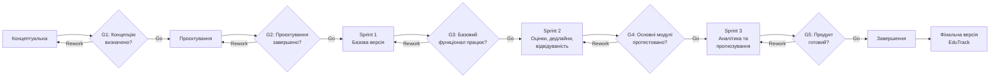

# Життєвий цикл проєкту EduTrack

## 5.1. Обрана модель життєвого циклу

**Модель:** Scrum
**Тип:** адаптивна (Agile)

Scrum підходить для EduTrack, оскільки проєкт є невеликим вебзастосунком із середньою невизначеністю вимог. Частину функціональності можна уточнювати під час розробки. Робота короткими спринтами дозволяє поступово створювати продукт, тестувати результати та виправляти помилки. Модель також підходить для невеликої команди та обмеженого часу розробки.

---

## 5.2. Фази життєвого циклу

| № | Назва фази              | Мета фази                                                          | Тривалість (тижнів) | Ключові роботи                                                                                            | Deliverables                                                                         | Відповідальний     |
| - | ----------------------- | ------------------------------------------------------------------ | ------------------: | --------------------------------------------------------------------------------------------------------- | ------------------------------------------------------------------------------------ | ------------------ |
| 1 | **Концептуальна**       | Визначити проблему, цілі, цільову аудиторію та основний функціонал |                   1 | Аналіз проблеми; визначення цілей; визначення цільової аудиторії; формування початкових вимог             | Опис проєкту; початковий перелік вимог; визначені цілі                               | Team Lead          |
| 2 | **Проєктування**        | Визначити структуру та зовнішній вигляд системи                    |                   1 | Проєктування структури системи; розробка макетів інтерфейсу; визначення структури даних; вибір технологій | Макет інтерфейсу; структура системи; схема даних                                     | Developer          |
| 3 | **Розробка — Sprint 1** | Реалізувати базову структуру вебзастосунку                         |                   2 | Створення структури застосунку; авторизація; базовий інтерфейс; робота з основними даними                 | Робочий прототип; авторизація; базовий особистий кабінет                             | Developer          |
| 4 | **Розробка — Sprint 2** | Реалізувати основні функції моніторингу навчання                   |                   2 | Реалізація оцінок; дедлайнів; відвідуваності; тестування                                                  | Модулі оцінок, дедлайнів і відвідуваності; результати тестування                     | Developer / Tester |
| 5 | **Розробка — Sprint 3** | Додати аналітику та прогнозування                                  |                   2 | Реалізація статистики; динаміки результатів; прогнозування підсумкової оцінки; тестування                 | Модулі аналітики та прогнозування; результати тестування                             | Developer / Tester |
| 6 | **Завершення**          | Перевірити готовність продукту та підготувати фінальну версію      |                   1 | Фінальне тестування; виправлення помилок; перевірка відповідності вимогам; підготовка документації        | Фінальна версія EduTrack; результати тестування; документація; демонстраційна версія | Team Lead / Tester |

---

## 5.3. Ворота між фазами

| Ворота | Між фазами                   | Критерії переходу                                                                                     | Можливі рішення    |
| ------ | ---------------------------- | ----------------------------------------------------------------------------------------------------- | ------------------ |
| **G1** | Концептуальна → Проєктування | Визначено проблему, цілі, цільову аудиторію та основний функціонал                                    | Go / Rework / Kill |
| **G2** | Проєктування → Sprint 1      | Визначено структуру системи, підготовлено макет інтерфейсу, визначено технології та структуру даних   | Go / Rework / Kill |
| **G3** | Sprint 1 → Sprint 2          | Базова версія системи працює, авторизація реалізована, критичні помилки відсутні                      | Go / Rework / Kill |
| **G4** | Sprint 2 → Sprint 3          | Реалізовано функції оцінок, дедлайнів і відвідуваності, основні функції протестовано                  | Go / Rework / Kill |
| **G5** | Sprint 3 → Завершення        | Реалізовано аналітику та прогнозування, основний функціонал протестовано, критичні помилки виправлено | Go / Rework / Kill |

---

## 5.4. Візуалізація життєвого циклу

---

## 5.5. Обґрунтування вибору моделі

EduTrack є невеликим вебзастосунком із середньою невизначеністю вимог. Основний функціонал визначений, але окремі можливості можуть уточнюватися під час розробки. Тому використання адаптивної моделі дозволяє змінювати пріоритети та доопрацьовувати функціональність під час виконання проєкту.

Як альтернативу можна було використати **Waterfall**, але ця модель передбачає послідовне виконання фаз і менш зручна при зміні вимог. Також можна було використати **інкрементну модель**, оскільки функціональність EduTrack можна додавати частинами. Scrum дозволяє поєднати поступову розробку функцій із регулярним тестуванням і коригуванням роботи.

Основною перевагою Scrum для EduTrack є поділ розробки на короткі спринти. Після кожного спринту команда отримує робочий результат, перевіряє його та визначає подальші роботи. Це дозволяє контролювати прогрес і своєчасно виявляти помилки.

Основними ризиками є нестача часу, помилки під час розробки та недостатня кількість даних для перевірки прогнозування. Для мінімізації ризиків команда планує визначати пріоритетність функцій, регулярно тестувати систему та використовувати тестові дані для перевірки прогнозування.

